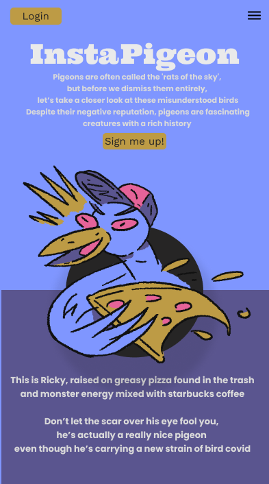

<br />
<div align="center">

<h3 align="center">Instapigeon</h3>

  <p align="center">
  An instagram for pigeons.
  </p>

<a style="font-size: 18px;" href="https://instapigeon.herokuapp.com/">See the app live</a> 🚀
<br/>
<br/>


</div>

## About The Project

**An instagram made for pigeons**

I was walking down the street, thinking about how to put something positive into the world instead of creating another social media platform. So what about an **instagram for pigeons** instead ? We'll think about expanding to your pets too in the future... as long as they can all be friends.

### Built With

[![React][React.js]][React-url]
[![MUI][MUI]][MUI-url]
[![SC][SC]][SC-url]
[![NodeJS][NodeJS]][NodeJS-url]
[![Express][Express]][Express-url]
[![MongoDB][MongoDB]][MongoDB-url]
[![Vite][Vite]][Vite-url]
[![Prettier][Prettier]][Prettier-url]
[![ESlint][ESlint]][ESlint-url]

## Getting Started

Instructions for running the project locally.

### Prerequisites

- npm (or the package manager your prefer)

  ```sh
  npm install npm@latest -g
  ```

### Installation

1. Clone the repo
   ```sh
   git clone https://github.com/KimJacobus/dashboard.git
   ```
2. Cd into the folder that has the package.json file then install the NPM packages
   ```sh
   npm install
   ```
3. Run the local client
   ```sh
   npm run dev
   ```

### figma prototypes :

[desktop](./readme-assets/instap-desktop.pdf)
[mobile](./readme-assets/instap-phone.pdf)
[styleguide](./readme-assets/instap-styleguide.pdf)

## Dependencies used

- [gsap](https://greensock.com/gsap/)
- [gh-pages](https://github.com/tschaub/gh-pages)

## Contact

jacobus.kim@gmail.com

<p align="right">(<a href="#readme-top">back to top</a>)</p>

[React.js]: https://img.shields.io/badge/React-20232A?style=for-the-badge&logo=react&logoColor=61DAFB
[React-url]: https://reactjs.org/
[Vite]: https://img.shields.io/badge/Vite-20232A?style=for-the-badge&logo=vite&logoColor=c061cb
[Vite-url]: https://vitejs.dev/
[MUI]: https://img.shields.io/badge/MUI-20232A?style=for-the-badge&logo=MUI&logoColor
[MUI-url]: https://mui.com/
[SC]: https://img.shields.io/badge/StyledComponents-20232A?style=for-the-badge&logo=styledcomponents&logoColor
[SC-url]: https://styled-components.com/
[NodeJS]: https://img.shields.io/badge/NodeJS-20232A?style=for-the-badge&logo=NodeJS&logoColor
[NodeJS-url]: https://tailwindcss.com/
[Express]: https://img.shields.io/badge/Express-20232A?style=for-the-badge&logo=Express&logoColor
[Express-url]: https://expressjs.com/
[GraphQL]: https://img.shields.io/badge/GraphQL-20232A?style=for-the-badge&logo=GraphQL&logoColor
[GraphQL-url]: https://graphql.org/
[MongoDB]: https://img.shields.io/badge/MongoDB-20232A?style=for-the-badge&logo=MongoDB&logoColor
[MongoDB-url]: https://www.mongodb.com/
[Prettier]: https://img.shields.io/badge/prettier-20232A?style=for-the-badge&logo=prettier&logoColor
[Prettier-url]: https://prettier.io/
[ESlint]: https://img.shields.io/badge/eslint-20232A?style=for-the-badge&logo=eslint&logoColor
[ESlint-url]: https://eslint.org/1
